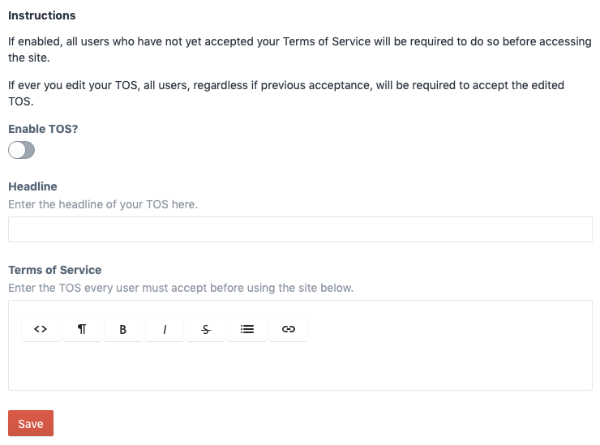

# Terms of Service plugin for Craft CMS 3.x

Use this plugin to force Craft users to consent to your TOS before being allowed access to all or certain portions of your site.



## Requirements

* This plugin requires Craft CMS 3.0.0-beta.23 or later.
* This plugin also requires that you install Redactor (free--find it in the Plugin Store).

## Installation

To install the plugin, follow these instructions.

1. Open your terminal and go to your Craft project:

        cd /path/to/project

2. Then tell Composer to load the plugin:

        composer require stianmandarin/craft-terms-of-service

3. In the Control Panel, go to Settings → Plugins and click the “Install” button for Terms of Service.

## Configuring Terms of Service

* Once installed, go to Terms of Service in the Craft CP.
  * Every new user must consent to the TOS if enabled.
  * All users, regardless of previous consent, must consent again if you save a new version of your TOS. 
* Use the code below as a jumping off point, e.g. placing it in your `_layout` file

```

    <p>Thank you for accepting our terms of service. You may now access our site.</p>



    <h1>{{ craft.craftTermsOfService.get('tosHeadline') }}</h1>
    {{ craft.craftTermsOfService.get('tosBody')|raw }}
    <a href="/actions/craft-terms-of-service/default/accept-tos">{{ 'I accept'|t }}</a>

    
    

```

## Using Terms of Service

* `{{ craft.craftTermsOfService.get('tosEnabled') }}` returns true if the TOS is enabled.
* `{{ craft.craftTermsOfService.get('tosHeadline') }}` returns the TOS headline
* `{{ craft.craftTermsOfService.get('tosBody')|raw }}` returns the TOS body
* `{{ craft.craftTermsOfService.get('userAcceptedVersion') }}` returns the version number of the TOS that the logged in user has consented to
* `{{ craft.craftTermsOfService.get('tosCurrentVersion') }}` returns the latest version number of the TOS, so that you can compare with the `userAcceptedVersion`

Use at your own risk.

## Roadmap

* Add norwegian translations

Brought to you by [Mandarin Design](https://mandarindesign.no)
